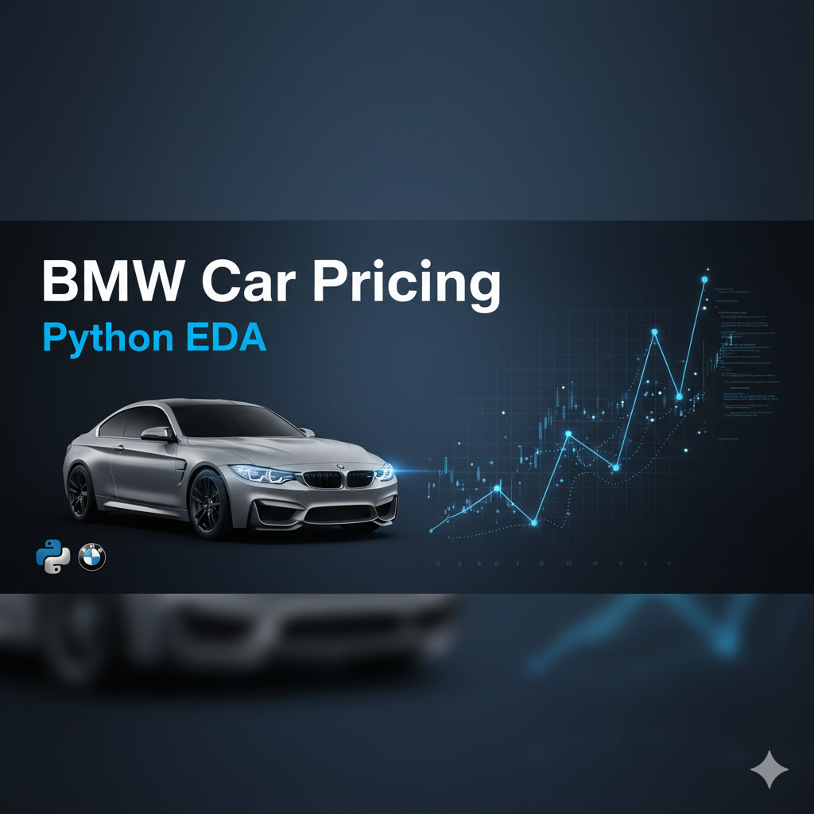
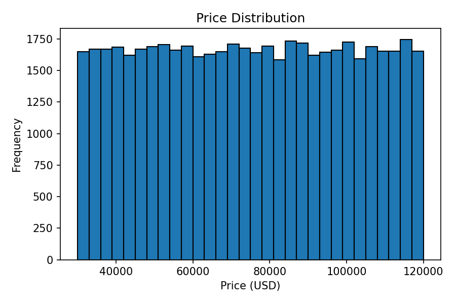
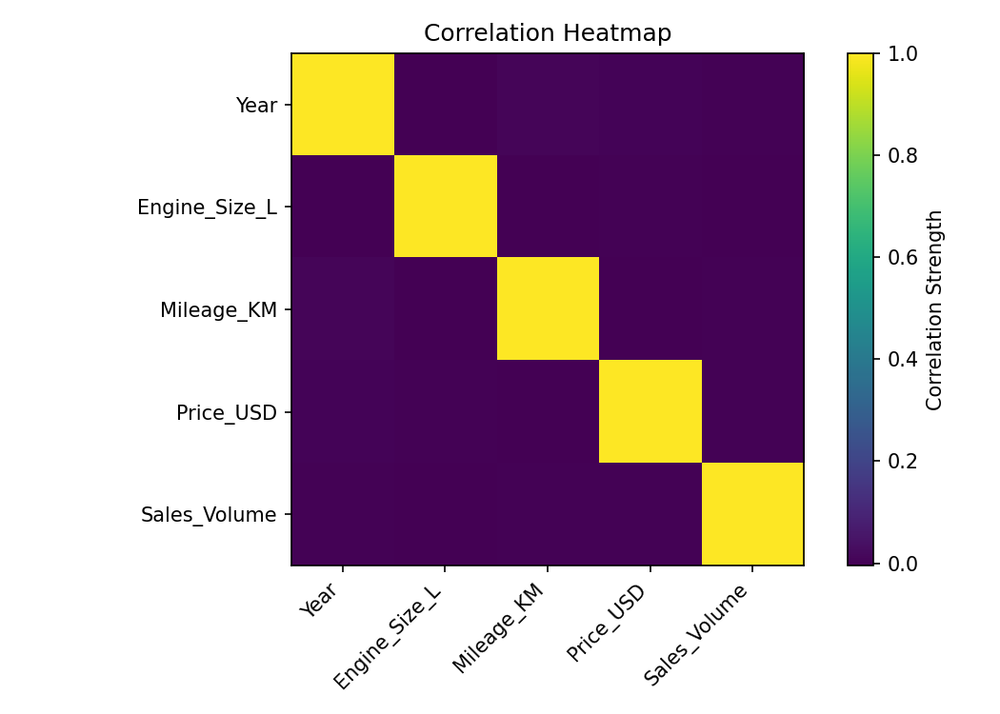

# 🚗 BMW Car Pricing — EDA (Python)

📄 **Read the Full Report:** [Findings.md](./Findings.md)

> 50,000-row BMW dataset. End-to-end EDA: data quality checks, distributions, category comparisons, correlation heatmap, and a simple regression demo.

## 🔍 Preview
 

